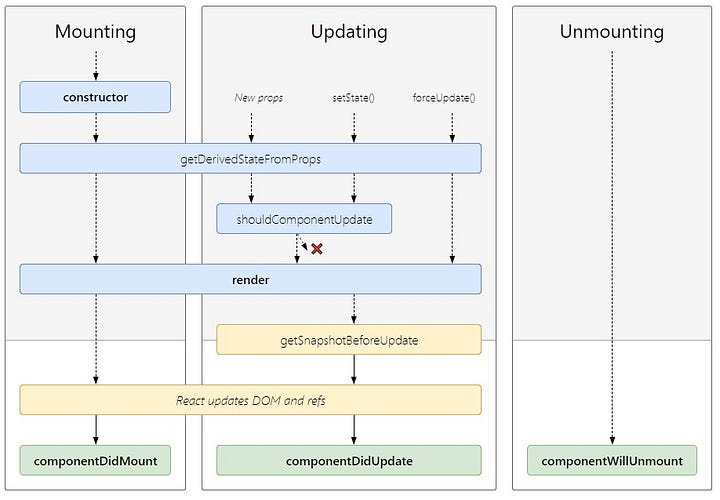

# React - Ciclo de Vida de Components

## 1. Tópicos

- [React - Ciclo de Vida de Components](#react---ciclo-de-vida-de-components)
  - [1. Tópicos](#1-tópicos)
  - [2. Anotações](#2-anotações)
    - [2.1. O que é Component Lifecycle](#21-o-que-é-component-lifecycle)
    - [2.2. As funções de cada fase:](#22-as-funções-de-cada-fase)
    - [2.3. Exemplos](#23-exemplos)
  - [3. Referências](#3-referências)

## 2. Anotações


### 2.1. O que é Component Lifecycle


No React, os componentes têm 3 fases de vida, onde cada uma tem funções específicas. Cada fase possui um conjunto de métodos de ciclos de vida que são chamados em pontos específicos do ciclo de vida do componente. Esses métodos permitem controlar o comportamento do componente e executar ações específicas em diferentes estágios do seu ciclo.

### 2.2. As funções de cada fase:





- **Montagem (Mounting)**: Quando o componente é criado, suas funções são:


  1. `constructor()`: Chamado quando o componente é criado, usado para inicializar o estado do componente.
  2. `getDerivedStateFromProps()`: Chamado para cada ciclo de renderização e dá a oportunidade de atualizar o estado do componente.
  3. `render()`: Método responsável por gerar o virtual DOM do componente baseado no state e props atuais.
  4. `componentDidMount()`: Uma vez que o componente é montado no DOM, esse método é chamado. É usado para preparar qualquer event listeners ou para realizar chamadas de API ou Fetch.


- **Atualização (Updating)**: Quando um componente já criado é atualizado:

  1. `getDerivedStateFromProps()`
  2. `shouldComponentUpdate()`: Chamado antes do componente ser atualizado. Recebe dois parâmetros: `nextProps` e `nextState` e retorna um booleano que determina se o componente deve ser atualizado ou não.
  3. `render()`
  4. `getSnapshotBeforeUpdate()`: Chamado antes da UI ser atualizada. Permite que o componente capture algumas informações sobre o estado atual da UI, como posição de scroll. Retorna o terceiro parâmetro para `componentDidUpdate()`.
  5. `componentDidUpdate()`: Chamado depois que o componente é atualizado e re-renderizado. É útil para realizar operações quando o `props` ou `state` de um componente mudar.


- **Desmontagem (Unmounting)**: Quando um componente é removido:

  1. `componentWillUnmount()`: Método chamado antes do componente ser removido da DOM. Permite realizar qualquer limpeza, como cancelar timers, remover event listeners ou limpar qualquer estrutura de dados que foi criada durante a fase de montagem. Após ser chamado, o componente é removido da DOM.


### 2.3. Exemplos

1. **Contructor()**

    ```js
    import React, { Component } from 'react'

    export default class App extends Component {
    constructor(props){
        super(props)
        this.state = {
        name: 'Constructor Method'
        }
    }

    render() {
        return (
        <div>
        <p> This is a {this.state.name}</p>
        </div>
        )
    }
    }
    ```

2. **ComponentDidMount()**
   
    ```js
    import React, { Component } from 'react';

    export default class componentDidMountMethod extends Component {
    constructor(props){
        super(props)
        this.state = {
        data: []
        }
    };

    componentDidMount() {
        fetch('https://jsonplaceholder.typicode.com/users').then(
            (response) => response.json()
        ).then(data => this.setState({data: data}))

    };

    render() {
        return (
        <div>
        <p>This will print all the name available in API users data</p>
        {this.state.data.map(d=> <h6 key={d.id}>{d.name}</h6>)}
        </div>
        )
    }
    }
    ```

## 3. Referências


- [Youtube - CFB Cursos: Ciclo de Vida dos componentes em REACT](https://www.youtube.com/watch?v=aeCiOmLlr94)
- [Youtube - Ralf Lima: Ciclo de vida (Lifecycle)](https://www.youtube.com/watch?v=TGIKm23yHNM)
- [FreeCodeCamp - Valentine Gatwiri: React Component Lifecycle Methods](https://www.freecodecamp.org/news/react-component-lifecycle-methods/)
- [Medium - Manish Mandal: React Lifecycle methods](https://medium.com/how-to-react/react-life-cycle-methods-with-examples-2bdb7465332b)
