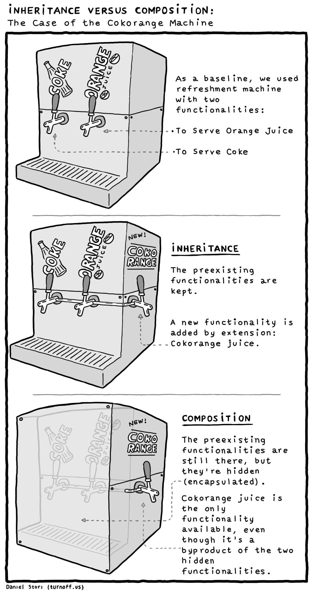

# React - Composição vs Herança

## 1. Tópicos

- [React - Composição vs Herança](#react---composição-vs-herança)
  - [1. Tópicos](#1-tópicos)
  - [2. Anotações](#2-anotações)
    - [2.1. Herança em React](#21-herança-em-react)
    - [2.2. Composição em React](#22-composição-em-react)
    - [2.3. Diferenças e Vantagens](#23-diferenças-e-vantagens)
    - [2.4. Porque composição é melhor](#24-porque-composição-é-melhor)
  - [3. Referências](#3-referências)

## 2. Anotações


### 2.1. Herança em React

herança é um conceito da **orientação a objetos**, permitindo que uma classe/componente herde as propriedades de outra classe/componente. Isso ocorre ao criar uma classe pai que contém funcionalidades que podem ser herdadas e complementadas por uma classe filha.

**Exemplo:** Imagine a criação de um sistema de cadastro de carros. Há características básicas compartilhadas entre os carros, como rodas, motor e volante. No entanto, existem tipos específicos de carros, como Carros Esportivos e Carros Pickup, que possuem características únicas. Aqui está como isso seria em código:
  
  ```js
  // Componente base comum
  class CarroBase extends React.Component {
    render() {
      return (
        <div>
          <h2>Carro Básico</h2>
          <p>Rodas: {this.props.wheels}</p>
          <p>Motor: {this.props.engine}</p>
          <p>Volante: {this.props.steering}</p>
        </div>
      );
    }
  }

  // Componente de Carro Esportivo
  class CarroEsportivo extends CarroBase {
    render() {
      return (
        <div>
          <h2>Carro Esportivo</h2>
          <p>Motor mais potente</p>
          {super.render()} {/* Chama o render da classe pai */}
        </div>
      );
    }
  }

  // Componente de Carro Pickup
  class CarroPickup extends CarroBase {
    render() {
      return (
        <div>
          <h2>Carro Pickup</h2>
          <p>Tração 4x4</p>
          <p>Carroceria Aberta</p>
          {super.render()} {/* Chama o render da classe pai */}
        </div>
      );
    }
  }

  // Uso dos componentes
  function App() {
    return (
      <div>
        <CarroEsportivo wheels="4" engine="V8" steering="Esportivo" />
        <CarroPickup wheels="4" engine="V12" steering="Couro" />
      </div>
    );
  }
  ```

### 2.2. Composição em React

Composição em React envolve a criação de **componentes reutilizáveis** e **combiná-los** para formar interfaces complexas. É como usar peças de Lego para criar estruturas maiores e mais elaboradas. Cada peça (componente) tem sua função específica, e você as combina para criar algo maior.

 1. Ex:
  ```js
  // Componente Avatar
  function Avatar(props) {
    return (
      
    );
  }

  // Componente Informações do Usuário
  function UserInfo(props) {
    return (
      <div className="user-info">
        <h2>{props.name}</h2>
        <p>Status: {props.status}</p>
      </div>
    );
  }

  // Composição de Componentes para criar o Perfil de Usuário
  function UserProfile(props) {
    return (
      <div className="user-profile">
        <Avatar image={props.avatarImage} name={props.userName} />
        <UserInfo name={props.userName} status={props.userStatus} />
      </div>
    );
  }

  // Uso dos componentes
  function App() {
    const userData = {
      avatarImage: "avatar.jpg",
      userName: "João",
      userStatus: "Online",
    };

    return (
      <div>
        <UserProfile
          avatarImage={userData.avatarImage}
          userName={userData.userName}
          userStatus={userData.userStatus}
        />
      </div>
    );
  }
  ```
### 2.3. Diferenças e Vantagens




Comparando herança e composição:

  1. Reuso de Código: Composição reutiliza componentes menores para construir interfaces complexas, enquanto herança reutiliza características de um componente.
  
  2. Flexibilidade: Composição oferece mais flexibilidade, pois a herança limita opções ao herdar diretamente do pai.
   
  3. Complexidade: Herança pode se tornar complexa e difícil de manter com múltiplas camadas. Composição tende a ser mais simples.

### 2.4. Porque composição é melhor

Em React, a composição geralmente é preferível à herança. Composição promove **reutilização de componentes independentes**, **simplifica a manutenção** e evita problemas associados à herança. Em casos **específicos**, a herança ainda pode ser útil, como quando se deseja estender características de forma específica.

## 3. Referências


- [Youtube - Web Dev Simplified: Why You Should Stop Using Inheritance](https://www.youtube.com/watch?v=nnwD5Lwwqdo)
- [Coding Ninjas - Difference Between Composition and Inheritance in React](https://www.codingninjas.com/studio/library/difference-between-composition-and-inheritance-in-react)